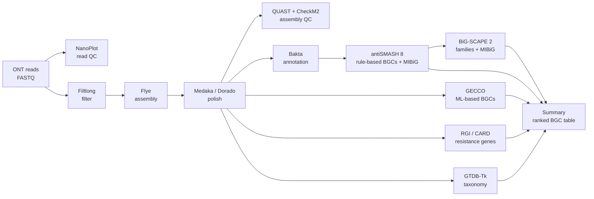

# ont-bgc-mining

A reusable pipeline for **genome mining of bacterial isolates sequenced with Oxford Nanopore (ONT)**. It goes from raw reads to a ranked list of biosynthetic gene clusters (BGCs) that may encode new antibiotics.

It was built for the Tiny Earth soil isolates in our P7 project (AAU, autumn 2026). It works for any bacterial isolate with ONT whole-genome data.



## What you get

| File | What it tells you |
|---|---|
| `cohort/12_summary/genome_summary.tsv` | One row per isolate: read yield, assembly size/contigs/N50, completeness, contamination, GTDB species, number of BGCs and resistance genes |
| `cohort/12_summary/bgc_summary.tsv` | One row per BGC, **ranked**: type, closest known BGC in MIBiG and % similarity, GECCO support, resistance gene inside the cluster, gene-cluster family, novelty call |
| `samples/<id>/07_antismash/antismash/index.html` | antiSMASH's interactive report, where you inspect each BGC by eye |
| `cohort/11_bigscape/output/index.html` | Interactive network of BGC families, including MIBiG references |
| `logs/software_versions.tsv`, `logs/config_used.sh` | Exactly what was run, for your Methods section |

## Quick start (on the Slurm server)

```bash
# 0. once: get the code
git clone https://github.com/<your-username>/ont-bgc-mining.git
cd ont-bgc-mining
test/run_tests.sh                       # self-test, takes seconds, needs no tools

# 1. once per server: your settings, software and databases (on the LOGIN node)
cp config/config.example.sh config/p7.sh
nano config/p7.sh                       # set OUTDIR, ENV_DIR, DB_DIR, Slurm partition
bin/setup_envs.sh      -c config/p7.sh  # ~30-60 min
bin/setup_databases.sh -c config/p7.sh  # hours (GTDB-Tk is ~110 GB)

# 2. per project: list your isolates (tab-separated)
cp config/samples.example.tsv config/samples.tsv
nano config/samples.tsv

# 3. check, then run
bin/run_pipeline.sh -c config/p7.sh --dry-run   # prints every command, runs nothing
slurm/submit.sh -c config/p7.sh                 # one job per isolate + one cohort job
squeue --me
```

On a machine without Slurm, run `bin/run_pipeline.sh -c config/p7.sh` instead. It processes the isolates one after another.

**Re-running is safe.** Finished steps are skipped, so after a crash you simply submit again. To redo a step, run `--force 07_antismash`. To run only some steps, use `--steps 07_antismash,12_summary`.

## Documentation — read in this order

1. [`docs/01_concepts.md`](docs/01_concepts.md): the biology and the ideas. Covers ONT data, assembly, BGCs, how "novel" is judged, and the limits.
2. [`docs/02_pipeline_steps.md`](docs/02_pipeline_steps.md): every step explained. Covers why it's there, why this tool, the key settings, and what to check in the output.
3. [`docs/03_setup_and_running.md`](docs/03_setup_and_running.md): installing, Slurm, resuming, and troubleshooting.
4. [`docs/04_bash_guide.md`](docs/04_bash_guide.md): the bash techniques used in the code, explained.
5. [`docs/05_git_github.md`](docs/05_git_github.md): saving, versioning and sharing the pipeline with git and GitHub.
6. [`docs/references.md`](docs/references.md): papers to cite for each tool.

## Repository layout

```
bin/        run_pipeline.sh (main), setup_envs.sh, setup_databases.sh
steps/      one file per group of steps; each function = one step, heavily commented
lib/        common.sh: logging, running tools in their conda env, resumable steps
scripts/    summarise_results.py (builds the two summary tables)
envs/       one conda recipe per tool
config/     config.example.sh, samples.example.tsv (copy and edit these)
slurm/      submit.sh (job array + cohort job), sample_job.sh
test/       run_tests.sh: syntax check, dry run, summary on mock data
docs/       explanations
legacy/     the first version of the pipeline (v1), kept for reference
```

## Citing

If you use this pipeline, cite the tools it runs (see `docs/references.md`) and the version (git tag) of this repository.
